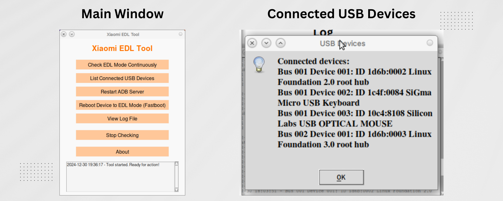
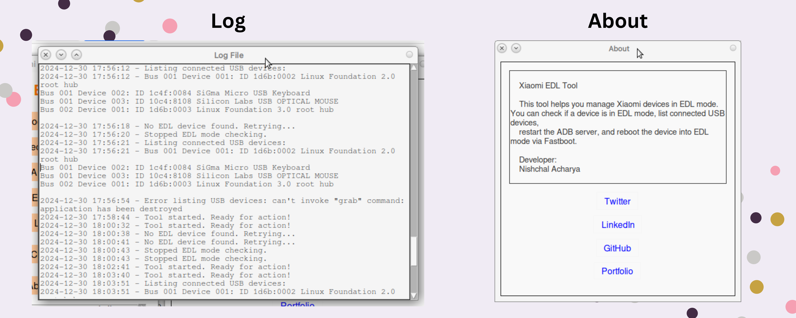

# Xiaomi EDL Tool 🚀

 


A simple Python-based tool for interacting with Xiaomi devices in **EDL mode** and other useful functionalities like ADB and Fastboot operations. This tool helps in detecting Xiaomi devices in **Emergency Download Mode (EDL)**, listing connected USB devices, and rebooting Xiaomi devices into EDL mode.

#
#
#

<p align="center">
  <a href="https://github.com/Nischal-Acharya/Xiaomi-EDL-Tool/graphs/contributors"></a>
  <a href="https://github.com/Nischal-Acharya/Xiaomi-EDL-Tool/stargazers"></a>
  <a href="https://github.com/Nischal-Acharya/Xiaomi-EDL-Tool/forks"></a>
  <a href="https://github.com/Nischal-Acharya/Xiaomi-EDL-Tool/blob/main/LICENSE"></a>
</p>


## Features
- **Check Xiaomi Devices in EDL Mode**: Continuously checks if a Xiaomi device is connected in EDL mode.
- **List Connected USB Devices**: Lists all connected USB devices using `lsusb`.
- **Restart ADB Server**: Restarts the ADB server to ensure communication with the connected device.
- **Reboot Xiaomi Device into EDL Mode (Fastboot)**: Reboots a Xiaomi device into EDL mode using Fastboot.
- **Log Viewer**: View logs for all operations in the tool.

## Supported Devices
This tool is designed to work with **Xiaomi** devices, particularly for detecting and interacting with devices in **EDL (Emergency Download) Mode**. 

It uses a **vendor ID** (`05c6:9008`) specific to Xiaomi devices in EDL mode.

### Supported Platforms
- **Linux**
     


## Installation

1. Clone this repository:

   ```bash
   git clone https://github.com/Nischal-Acharya/xiaomi-edl-tool.git
   cd xiaomi-edl-tool
   ```

2. Create a Python virtual environment:

   ```bash
   python3 -m venv venv
   source venv/bin/activate
   ```

3. Install required dependencies:

   ```bash
   pip install -r requirements.txt
   ```

4. **Dependencies**:
   - `subprocess` (for interacting with ADB and Fastboot)
   - `tkinter` (for the graphical user interface)
   - `lsusb` (for listing USB devices)
   - **Python 3.x** is required.

5. Make sure **ADB** and **Fastboot** are installed on your system:

   - **ADB**: [ADB installation guide](https://developer.android.com/studio/command-line/adb)
   - **Fastboot**: [Fastboot installation guide](https://developer.android.com/studio/command-line/fastboot)

## Usage

1. Run the tool:

   ```bash
   python edl.py
   ```

2. The graphical user interface will open, and you will see the following buttons:
   - **Check EDL Mode**: Start continuous checking for Xiaomi devices in EDL mode.
   - **List USB Devices**: List all connected USB devices.
   - **Restart ADB Server**: Restart the ADB server.
   - **Reboot to EDL**: Reboot a Xiaomi device into EDL mode via Fastboot.
   - **View Log**: View logs for all operations performed.
   - **Stop Checking**: Stop the continuous EDL mode checking.

### About Section
This tool was developed by **Nishchal Acharya (ME)**. It's built to simplify the process of managing Xiaomi devices in **EDL Mode** and to make working with ADB and Fastboot operations more accessible.

## Contributing

Feel free to contribute to this project! Fork the repository, create a branch, and send a pull request. Contributions are always welcome!

### How to Contribute:
1. Fork the repository.
2. Create a new branch.
3. Implement your changes or fixes.
4. Test your changes.
5. Create a pull request.

We appreciate your contributions!

## License

This project is licensed under the **MIT License**. See the [LICENSE](LICENSE) file for more details.

## Contact

- **Creator**: [Nishchal Acharya](https://nishchalacharya.com.np/)
- **Twitter**: [@nishchal_acc](https://x.com/nishchal_acc)
- **LinkedIn**: [Nishchal Acharya](https://www.linkedin.com/in/nishchalacharya/)
- **GitHub**: [Nishchal-Acharya](https://github.com/Nischal-Acharya)
- **Portfolio**: [nishchalacharya.com.np](https://nishchalacharya.com.np/)

## Screenshots

**Main Window:**
 

**Log Window:**
 

## FAQs

### 1. **Will this tool work with any Android device?**
   No, this tool is specifically designed for Xiaomi devices. It detects EDL mode, which is unique to Xiaomi devices. For other Android devices, modifications are needed.

### 2. **What if I don't have `adb` or `fastboot`?**
   You need to install **ADB** and **Fastboot** on your system to use this tool. You can follow the installation guides linked above.

### 3. **Is this tool safe to use?**
   Yes, the tool is safe to use as long as you follow the instructions correctly. It does not modify your device permanently, but please use it responsibly when rebooting your device into EDL mode.

---

### Thank you for using Xiaomi EDL Tool! 🎉
